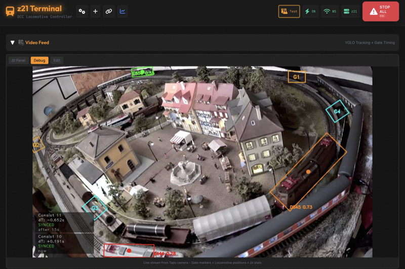
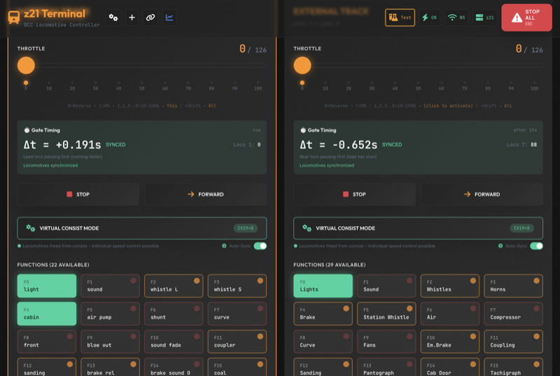
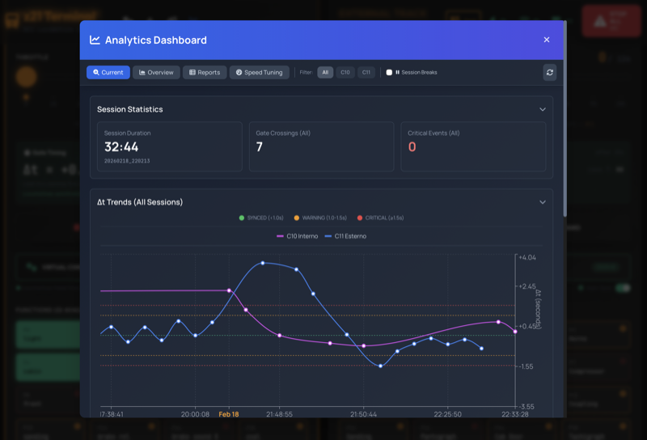
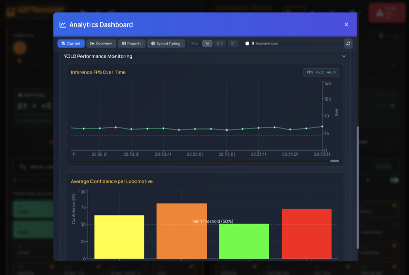
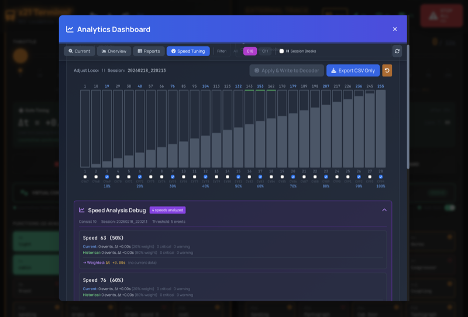

# z21-Terminal

**Autonomous web-based DCC locomotive controller** with real-time YOLO tracking, automatic speed compensation, and multi-device sync via Z21 LAN protocol.

**Version**: v1.0.0

**Key Highlights**:
- 🚂 **JMRI-Independent**: Fully autonomous operations (roster, functions, speed tables managed in web UI)
- 🎯 **YOLO Tracking**: Custom-trained AI detection with GPU acceleration (TensorRT)
- 📱 **Modern Web UI**: Mobile-first PWA with real-time WebSocket sync (iPad, phone, desktop)
- ⚙️ **Complete Settings**: Edit locomotive functions F0-F28, speed tables CV67-94, consists — all in web UI
- 🔄 **Virtual Mode**: Automatic speed compensation based on real-time Δt feedback

---

## Features

### Web Dashboard
- Modern, mobile-first responsive UI (React + Vite + Tailwind)
- Real-time WebSocket synchronization across multiple devices
- **Function Editor**: Edit F0-F28 labels and lockable flags (accordion UI, hot reload)
- **Speed Table Editor**: View/edit CV67-94 speed curves (direct CV write, color-coded recommendations)
- **Consist Manager**: Full CRUD operations via web UI (create/edit/delete consists, gate assignment)
- **CV3/CV4 Editor**: Inline acceleration/deceleration editor
- Touch-optimized controls, PWA installable, wake-lock, emergency stop, track power & Z21 health monitoring

### YOLO Tracking
- Custom-trained YOLO object detection, GPU-accelerated (TensorRT, 2-5x faster)
- Gate timing detection (symmetric oval / asymmetric figure-8)
- Real-time video feed with gate overlays and Δt stats panel
- Automatic speed compensation in Virtual Mode (Δt-based, bang-bang + decay)

### Virtual Consist Mode
- Automatic CV19 management (DCC ↔ Virtual toggle)
- Real-time Δt-based speed compensation
- Reference-loco strategy (never touch the stable reference loco)
- Transparent UX: single slider, dual locomotive control behind the scenes

### Analytics Dashboard
- Session tracking with automatic lifecycle
- Δt trends visualization (speed matching quality, color-coded thresholds)
- YOLO performance monitoring (FPS + per-locomotive confidence)
- Locomotive operating time (maintenance planning)
- Current vs overview views, intelligent downsampling

---

## Screenshots

<p align="center">
  <a href="Screenshots/Screenshot_1.png"></a>
  <a href="Screenshots/Screenshot_2.png"></a>
  <a href="Screenshots/Screenshot_3.png"></a>
</p>
<p align="center">
  <a href="Screenshots/Screenshot_4.png"></a>
  <a href="Screenshots/Screenshot_5.png"></a>
</p>

*Click a thumbnail to view the full-size screenshot.*

---

## Requirements

- **Control Station**: Roco Z21 (White, Black, or Pro) connected to your network
- **Network**: Z21 and the computer on the same network (or via VPN)
- **Python** 3.8+ and **Node.js** 18+ (for frontend build)
- **Optional**: JMRI (initial decoder setup), IP camera with RTSP support (for YOLO tracking), NVIDIA GPU with CUDA (for TensorRT acceleration)

---

## Installation / Quick Start

1. Clone the repository
2. Install Python dependencies: `pip install -r requirements.txt`
3. Install frontend dependencies: `cd web && npm install`
4. Configure `config.json` (and `config.local.json` for machine-specific credentials)
5. Start the backend: `python backend/main.py`
6. Start the frontend: `cd web && npm run dev` (development) or `npm run build` + serve via backend (production)

Access the dashboard at:
- **Local**: `http://localhost:5173` (dev) / `http://localhost:8000` (production)
- **LAN**: `http://192.168.X.X:5173` (dev) / `http://192.168.X.X:8000` (production)
- **Remote (optional, via VPN/Tailscale)**: `https://<hostname>.tailXXXXXX.ts.net`

---

## Architecture

```
┌─────────────┐     ┌──────────────┐     ┌────────────┐
│  Frontend   │◀──▶│   Backend    │────▶│    Z21     │
│ React PWA   │     │ FastAPI + WS │     │ Controller │
│  (port 5173)│     │  (port 8000) │     │   (UDP)    │
└─────────────┘     └───────┬──────┘     └────────────┘
                            │
                     ┌──────┴────────┐
                     │               │
                ┌────▼─────┐   ┌─────▼──────┐
                │ data.db  │   │ YOLO Daemon│
                │ (SQLite) │   │ (Tracking) │
                └──────────┘   └────────────┘
```

- `backend/` — FastAPI backend (routers, services, WebSocket handlers, tracking)
- `web/` — React frontend (Vite + Tailwind)
- `scripts/` — CLI utilities and YOLO training pipeline
- `config.json` — central configuration (consists, gates, thresholds)

---

## Deployment

z21-Terminal can be deployed on a single host that also runs the Z21-control network.

### Development
- Backend on port **8000**, frontend dev server on port **5173** (Vite HMR)

### Production
- Backend serves the built frontend on port **8000**
- Optional NVIDIA GPU for TensorRT-accelerated YOLO inference
- The backend runs as a **background service** (survives sessions, restarts on demand)

For multi-locomotive tracking, the system uses a camera (RTSP) and a trained YOLO model. See `docs/COMPUTER_VISION.md` for training details.

---

## Configuration

### config.json
Central configuration: consists, gates, tracking FPS/thresholds, YOLO parameters, analytics, locomotives.

### config.local.json
Machine-specific overrides (camera credentials, debug mode) — gitignored, never committed.

---

## JMRI Relationship

z21-Terminal is **autonomous for daily operations**, but **JMRI is needed for initial decoder setup** (one-time per locomotive):

- **Initial setup** (JMRI/DecoderPro): configure decoder address (CV1), function mapping, decoder settings
- **Daily operations** (z21-Terminal, no JMRI needed): functions, speed tables, consists, control, compensation

---

## Notes

- **YOLO Training**: DCC address must be the class prefix (e.g., `7_E656_239`). Do **not** change a locomotive's CV1 address after training — it breaks the class mapping.
- **Virtual Mode** provides real-time compensation without writing CVs. CV Profiles (hotkey `T`) offer a TEST/NORMAL toggle for instant speed response (writes CV3/CV4).

---

## License

This project is released under the MIT License. See the [LICENSE](LICENSE) file for details.
